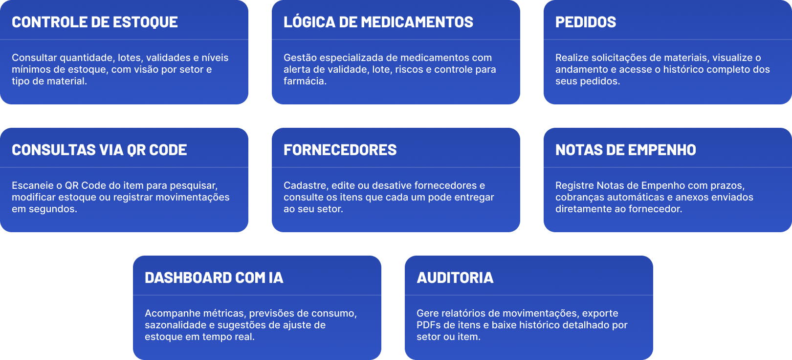
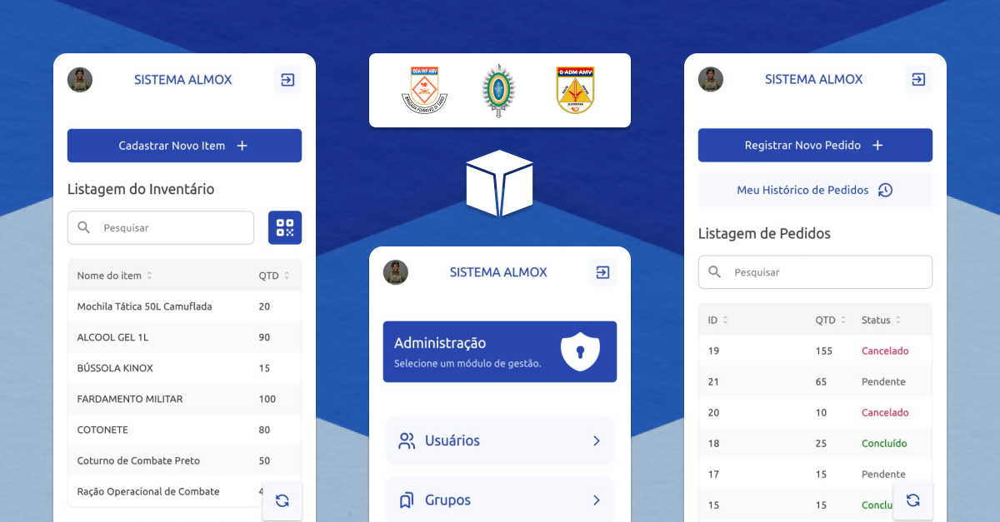
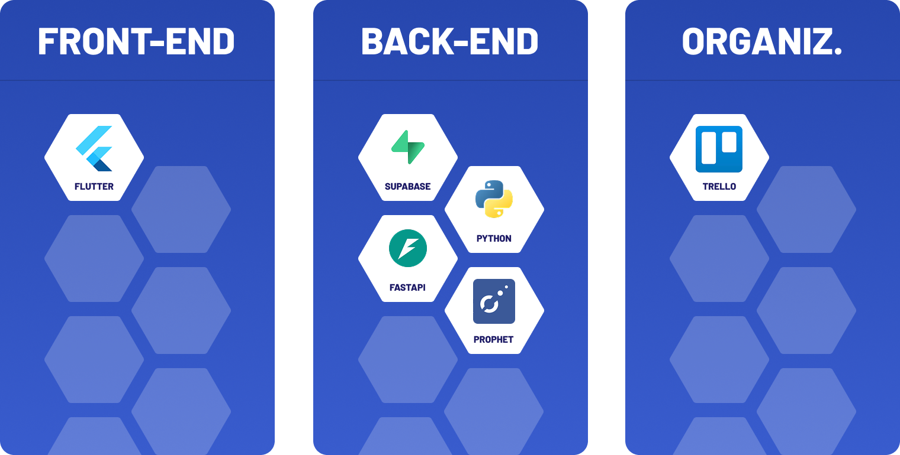

  <a href="#desafio">Desafio</a> |
  <a href="#solucao">Solução</a> |
  <a href="#tecnologias">Tecnologias</a> |
  <a href="#backlog">Backlog Sprint 2</a> |
  <a href="#cronograma">Cronograma de Sprints</a> |
  <a href="#time">Time</a>

 

## 📖 Desafio

O projeto trata-se do desenvolvimento de um aplicativo para gestão do almoxarifado militar de múltiplos setores. Atualmente, o processo de controle de materiais é burocrático e suscetível a falhas, dificultando a organização, rastreabilidade e agilidade no atendimento das demandas. Essa dificuldade gera retrabalho, perda de tempo e risco de falta de materiais essenciais. Para resolver isso, o aplicativo oferece as seguintes funcionalidades:

 

 
 
 

## 🎯 Solução

A solução proposta é um sistema simples e eficiente que centraliza o controle do almoxarifado em um único aplicativo. Ele permitirá cadastrar novos itens ou reabastecer estoque, registrar pedidos de forma rápida, gerar e ler QR Codes automaticamente e acompanhar o inventário em tempo real. Com isso, o almoxarifado terá mais organização, previsibilidade de consumo, transparência e redução de erros no processo de gestão de materiais.

 
 
 

  
## 🛠️ Tecnologias

 
 
 

## 📋 Backlog de User Stories

| Rank | Prioridade | User Story | Estimativa | Sprint |
|:---|:---|:---|:---|:---|
| 1 | Alta | Como usuário, desejo fazer login no sistema para acessar as funcionalidades. | 3 | 01 |
| 2 | Alta | Como usuário, desejo registrar pedidos para solicitar itens necessários. | 8 | 01 |
| 3 | Alta | Como usuário, desejo fazer pesquisa de itens via QR Code para agilizar minha busca. | 3 | 01 |
| 4 | Alta | Como usuário, desejo acompanhar o histórico e o status detalhado dos meus pedidos para saber o andamento. | 2 | 01 |
| 5 | Alta | Como tenente, desejo aprovar ou rejeitar pedidos pendentes do meu setor, com a opção de adicionar justificativa para rejeição. | 3 | 01 |
| 6 | Alta | Como tenente de almoxarifado, desejo consultar o estoque geral, incluindo lotes e validades, para ter controle dos materiais. | 2 | 01 |
| 7 | Alta | Como tenente de almoxarifado, desejo cadastrar a entrada de novos produtos com lote e data de vencimento para manter o inventário atualizado. | 3 | 01 |
| 8 | Alta | Como tenente de farmácia, desejo gerenciar o estoque de medicamentos com foco crítico em lote e data de vencimento para garantir a segurança. | 3 | 01 |
| 9 | Alta | Como usuário, desejo fazer modificações rápidas de estoque de um item via escaneamento de QR Code. | 5 | 01 |
| 10 | Média | Como usuário, desejo consultar o estoque disponível para solicitação de materiais antes de fazer um pedido. | 1 | 01 |
| 11 | Média | Como tenente de almoxarifado, desejo cadastrar novos tipos de produtos no catálogo para expandir as opções disponíveis. | 5 | 01 |
| 12 | Média | Como tenente de farmácia, desejo cadastrar novos medicamentos no sistema para manter o catálogo atualizado. | 5 | 01 |
| 13 | Média | Como tenente de um setor, desejo definir níveis de estoque mínimo de itens para auxiliar as predições do Dashboard de IA. | 1 | 01 |
| 15 | Alta | Como usuário, desejo poder cadastrar múltiplos lotes a um único item, caso ele tenha data de validade (perecível) | 5 | 02 |
| 16 | Alta | Como usuário, desejo poder escolher múltiplos lotes de um item, caso ele seja perecível, ao fazer um novo pedido. | 5 | 02 |
| 14 | Alta | Como tenente de um setor, desejo cadastrar, editar e consultar fornecedores, para centralizar a gestão de contatos. | 5 | 02 |
| 17 | Alta | Como usuário de um setor, desejo visualizar o histórico de movimentação do meu setor, detalhando as entradas, saídas e reservas de um item. | 13 | 02 |
| 18 | Alta | Como usuário de um setor, desejo ter a opção de baixar o relatório de auditória de movimentação de estoque de itens do meu setor, ou de um item específico. | 8 | 02 |
| 19 | Alta | Como usuário, desejo poder baixar um PDF com um QR code do número de ficha de um item. | 1 | 02 |
| 20 | Alta | Como tenente de um setor, desejo cadastrar, editar e excluir as categorias (grupos) de itens do meu setor. | 3 | 02 |
| 21 | Alta | Como tenente ou coronel, desejo cadastrar, editar e desativar os fornecedores que podem estar vinculados a uma nota de empenho. | 3 | 02 |
| 22 | Alta | Como tenente ou coronel, desejo poder ver uma lista de itens que um fornecedor pode me entregar. | 1 | 02 |
| 23 | Alta | Como tenente de um setor, desejo cadastrar uma Nota de Empenho vinculada a um fornecedor, definindo data de entrega, frequência de cobrança e urgência, para digitalizar o controle. | 8 | 02 |
| 25 | Alta | Como coronel, desejo visualizar e gerenciar perfis de qualquer setor e nível de acesso para manter as informações atualizadas. | 8 | 02 |
| 25 | Alta | Como usuário, desejo escanear o QR code do número de ficha de um item para poder modificar de forma rápida o estoque dele. | 5 | 02 |
| 24 | Alta | Como usuário, desejo agendar meus próprios exames, escolhendo um médico e os horários disponíveis do mesmo. | 8 | 02 |
| 26 | Média | Como paciente, desejo visualizar meus agendamentos, consultar o preparo para o exame e, se necessário, realizar o cancelamento. | 5 | 02 |
| 28 | Alta | Como coronel, desejo cadastrar, editar e desativar usuários no sistema. | 8 | 02 |
| 29 | Alta | Como tenente de um setor, desejo que o sistema envie e-mails automáticos para fornecedores na entrada de um pedido (com a NE anexa), em cobranças de atraso e na finalização do pedido. | 8 | 03 |
| 30 | Alta | Como tenente, desejo acessar um Painel de Controle Analítico com IA para visualizar gráficos de movimentação e alertas de validade do meu setor. | 8 | 03 |
| 31 | Alta | Como coronel, desejo visualizar o Painel de Controle Analítico com IA em uma visão global, podendo filtrar e comparar dados de todos os setores. | 2 | 03 |
| 32 | Alta | Como coronel, desejo gerenciar vínculos e patentes, atribuindo usuários a perfis de acesso e módulos de gestão específicos. | 2 | 03 |
| 33 | Média | Como usuário, desejo recuperar minha senha caso eu a esqueça. | 5 | 03 |
| 34 | Média | Como tenente, desejo que o Dashboard com IA identifique padrões de sazonalidade de consumo dos itens do meu setor para otimizar o estoque. | 13 | 03 |
| 35 | Média | Como tenente, desejo que o Dashboard com IA preveja futuras tendências de estoque para o meu módulo para auxiliar no planejamento. | 13 | 03 |
| 36 | Média | Como tenente, desejo que o Dashboard com IA sugira ajustes nos níveis de estoque mínimo para melhorar a gestão. | 5 | 03 |
| 37 | Baixa | Como tenente, desejo gerar e exportar relatórios específicos do meu módulo de gestão (Estoque ou Farmácia). | 2 | 03 |

---

### 📊 Resumo por Sprint

| Sprint | User Stories | Pontos | Documentação |
|--------|-------------|--------|--------------|
| **01** | 13 | 44 | [Sprint 1](./docs/processo/sprints/sprint-1/README.md) |
| **02** | 15 | 86 | [Sprint 2](./docs/processo/sprints/sprint-2/README.md) |
| **03** | 10 | 58 | [Sprint 3](./docs/processo/sprints/sprint-3/README.md) |

 
 
 

## 🗓️ Cronograma de Sprints

| Sprint          |    Período    | Documentação                                     |
| --------------- | :-----------: | ------------------------------------------------ |
| **01** | 08/09 - 28/09 | [Sprint 1](./docs/processo/sprints/sprint-1/README.md) |
| **02** | 06/10 - 26/10 | [Sprint 2](./docs/processo/sprints/sprint-2/README.md) |
| **03** | 03/11 - 23/11 | [Sprint 3](./docs/processo/sprints/sprint-3/README.md) |

 
 
 

## 👷🏻 Time de Desenvolvimento

| Foto | Nome | Função | Github | LinkedIn |
| :--: | :----: | :--: | :----: | :------: |
|  | Diogo Palharini | Product Owner |  |  |
|  | Marco Antonio Arantes | Scrum Master |  |  |
|  | Eber de Souza Junior | DEV Team |  |  |
|  | Erika Dias Ribeiro | DEV Team |  |  |
|  | Juan Garcia Soares | DEV Team |  |  |
|  | Gabriel Santos | DEV Team |  |  |
