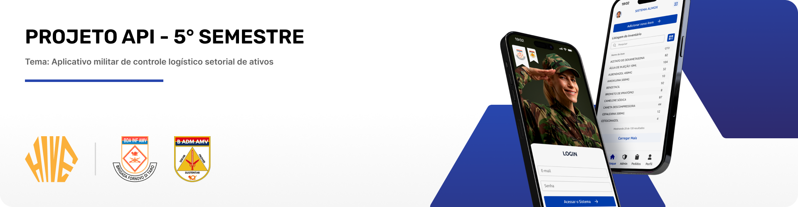

  <a href="#desafio">Desafio</a> |
  <a href="#tecnologias">Tecnologias</a> |
  <a href="#solucao">Solução</a> |   
  <a href="#backlog">Backlog do Produto</a> |
  <a href="#dor">DoR</a> |
  <a href="#dod">DoD</a> |
  <a href="#cronograma">Cronograma de Sprints</a> |
  <a href="#manual">Manual de Instalação</a> |
  <a href="#time">Time</a>

 

  
## 🛠️ Tecnologias

<h4>
  
  
  
  
  
  
</h4>

 

## 📖 Desafio

O projeto trata-se do desenvolvimento de um aplicativo para gestão do almoxarifado militar. Atualmente, o processo de controle de materiais é burocrático e suscetível a falhas, dificultando a organização, rastreabilidade e agilidade no atendimento das demandas. Essa dificuldade gera retrabalho, perda de tempo e risco de falta de materiais essenciais. Para resolver isso, o aplicativo precisa oferecer três pontos principais:

Cadastro de materiais: inserção e atualização de itens com informações completas.

Leitura por QR Code: agilizando entradas e saídas de materiais de forma automática e segura.

Interface intuitiva: design limpo, responsivo e de fácil uso, tanto em smartphones quanto em tablets.

 

## 🎯 Solução

A solução proposta é um sistema simples e eficiente que centraliza o controle do almoxarifado em um único aplicativo. Ele permitirá cadastrar novos itens ou reabastecer estoque, registrar pedidos de forma rápida, gerar e ler QR Codes automaticamente e acompanhar o inventário em tempo real. Com isso, o almoxarifado terá mais organização, previsibilidade de consumo, transparência e redução de erros no processo de gestão de materiais.

 

## 📋 Backlog do Produto

| Rank | Prioridade | User Story | Estimativa | Sprint |
|------|------------|------------|------------|--------|
| 1 | Alta | Como usuário, desejo fazer login no sistema para acessar as funcionalidades. | 3 | 01 |
| 2 | Alta | Como usuário, desejo registrar pedidos para solicitar itens necessários. | 8 | 01 |
| 3 | Alta | Como usuário, desejo fazer pesquisa de itens via QR Code para agilizar minha busca. | 3 | 01 |
| 4 | Alta | Como usuário, desejo acompanhar o histórico e o status detalhado dos meus pedidos para saber o andamento. | 2 | 01 |
| 5 | Alta | Como tenente, desejo aprovar ou rejeitar pedidos pendentes do meu setor, com a opção de adicionar justificativa para rejeição. | 3 | 01 |
| 6 | Alta | Como tenente de almoxarifado, desejo consultar o estoque geral, incluindo lotes e validades, para ter controle dos materiais. | 2 | 01 |
| 7 | Alta | Como tenente de almoxarifado, desejo cadastrar a entrada de novos produtos com lote e data de vencimento para manter o inventário atualizado. | 3 | 01 |
| 8 | Alta | Como tenente de farmácia, desejo gerenciar o estoque de medicamentos com foco crítico em lote e data de vencimento para garantir a segurança. | 3 | 01 |
| 9 | Alta | Como tenente odontológico, desejo gerenciar o estoque de insumos odontológicos, controlando lote e validade. | 3 | 01 |
| 10 | Média | Como usuário, desejo consultar o estoque disponível para solicitação de materiais antes de fazer um pedido. | 1 | 01 |
| 11 | Média | Como tenente de almoxarifado, desejo cadastrar novos tipos de produtos no catálogo para expandir as opções disponíveis. | 5 | 01 |
| 12 | Média | Como tenente de farmácia, desejo cadastrar novos medicamentos no sistema para manter o catálogo atualizado. | 5 | 01 |
| 13 | Média | Como tenente odontológico, desejo cadastrar novos insumos no inventário de odontologia. | 5 | 01 |
| 14 | Alta | Como usuário, desejo fazer modificações rápidas de estoque de um item via escaneamento de QR Code. | 5 | 01 |
| 15 | Média | Como tenente de almoxarifado, desejo definir níveis de estoque mínimo de itens para auxiliar as predições do Dashboard de IA. | 1 | 01 |
| 16 | Alta | Como coronel, desejo visualizar e gerenciar perfis (meu, de tenentes e de soldados) para manter as informações atualizadas. | 8 | 02 |
| 17 | Média | Como tenente de farmácia, desejo registrar a entrega (dispensação) de medicamentos a um paciente para controle. | 8 | 02 |
| 18 | Média | Como tenente odontológico, desejo registrar procedimentos e materiais utilizados por paciente para histórico. | 8 | 02 |
| 19 | Alta | Como usuário, desejo agendar uma consulta (médica ou odontológica) para cuidar da minha saúde. | 8 | 02 |
| 20 | Alta | Como tenente de farmácia, desejo aprovar ou cancelar agendamentos de consultas médicas para organizar a agenda. | 5 | 02 |
| 21 | Alta | Como tenente odontológico, desejo aprovar ou cancelar agendamentos de consultas odontológicas. | 5 | 02 |
| 22 | Média | Como usuário, desejo visualizar meu histórico unificado de agendamentos (médicos e odonto) para ter controle das minhas consultas. | 5 | 02 |
| 23 | Média | Como usuário, desejo anexar documentos (receitas, atestados) aos meus agendamentos para facilitar o processo. | 3 | 02 |
| 24 | Média | Como usuário, desejo consultar meu histórico de medicamentos recebidos e tratamentos odontológicos realizados para referência. | 3 | 02 |
| 25 | Alta | Como tenente, desejo acessar um Painel de Controle Analítico com IA para visualizar gráficos de movimentação e alertas de validade do meu setor. | 8 | 03 |
| 26 | Alta | Como coronel, desejo visualizar o Painel de Controle Analítico com IA em uma visão global, podendo filtrar e comparar dados de todos os setores. | 2 | 03 |
| 27 | Alta | Como coronel, desejo cadastrar novos usuários no sistema. | 5 | 03 |
| 28 | Alta | Como coronel, desejo ativar/inativar usuários para gerenciar o acesso sem perder o histórico. | 3 | 03 |
| 29 | Alta | Como coronel, desejo gerenciar vínculos e patentes, atribuindo usuários a perfis de acesso e módulos de gestão específicos. | 2 | 03 |
| 30 | Média | Como usuário, desejo recuperar minha senha caso eu a esqueça. | 5 | 03 |
| 31 | Média | Como tenente, desejo que o Dashboard com IA identifique padrões de sazonalidade de consumo dos itens do meu setor para otimizar o estoque. | 13 | 03 |
| 32 | Média | Como tenente, desejo que o Dashboard com IA preveja futuras tendências de estoque para o meu módulo para auxiliar no planejamento. | 13 | 03 |
| 33 | Média | Como tenente, desejo que o Dashboard com IA sugira ajustes nos níveis de estoque mínimo/máximo para melhorar a gestão. | 5 | 03 |
| 34 | Baixa | Como tenente, desejo gerar e exportar relatórios específicos do meu módulo de gestão (Estoque, Farmácia ou Odonto). | 2 | 03 |
| 35 | Baixa | Como coronel, desejo redefinir senhas de usuários para recuperar o acesso de contas de tenentes e soldados. | 2 | 03 |

 

## 🏁 ‍DoR - Definition of Ready

* ✅ User Story escrita com **critérios de aceitação claros**  
* ✅ Subtarefas criadas a partir da **User Story**  
* ✅ **Design pronto** no Figma 
* ✅ **Modelagem do Banco de Dados** definida  
* ✅ **Fluxo de rotas** documentado  
* ✅ Dados de clientes **estruturados/vetorizados** (quando aplicável)

 

## ✅ DoD - Definition of Done 

* ✅ **Manual de Usuário** disponível  
* ✅ **Manual da Aplicação** documentado  
* ✅ **Documentação da API** atualizada  
* ✅ **Código completo e revisado**  
* ✅ **Vídeos e documentos de entrega** (explicando ou demonstrando cada etapa)  

 

## 🗓️ Cronograma de Sprints

| Sprint          |    Período    | Documentação                                     |
| --------------- | :-----------: | ------------------------------------------------ |
| 🐝 **SPRINT 01** | 08/09 - 28/09 | [Sprint 1](./docs/processo/sprints/sprint-1/README.md) |
| 🐝 **SPRINT 02** | 06/10 - 26/10 | [Sprint 2](./docs/processo/sprints/sprint-2/README.md) |
| 🐝 **SPRINT 03** | 03/11 - 23/11 | [Sprint 3](./docs/processo/sprints/sprint-3/README.md) |

 

## 📖 Manual de Instalação

⏳ Em desenvolvimento

 

## 👷🏻 Time de Desenvolvimento

| Foto | Nome | Função | Github | LinkedIn |
| :--: | :----: | :--: | :----: | :------: |
|  | Diogo Palharini | Product Owner |  |  |
|  | Marco Antonio Arantes | Scrum Master |  |  |
|  | Eber de Souza Junior | DEV Team |  |  |
|  | Erika Dias Ribeiro | DEV Team |  |  |
|  | Juan Garcia Soares | DEV Team |  |  |
|  | Gabriel Santos | DEV Team |  |  |
